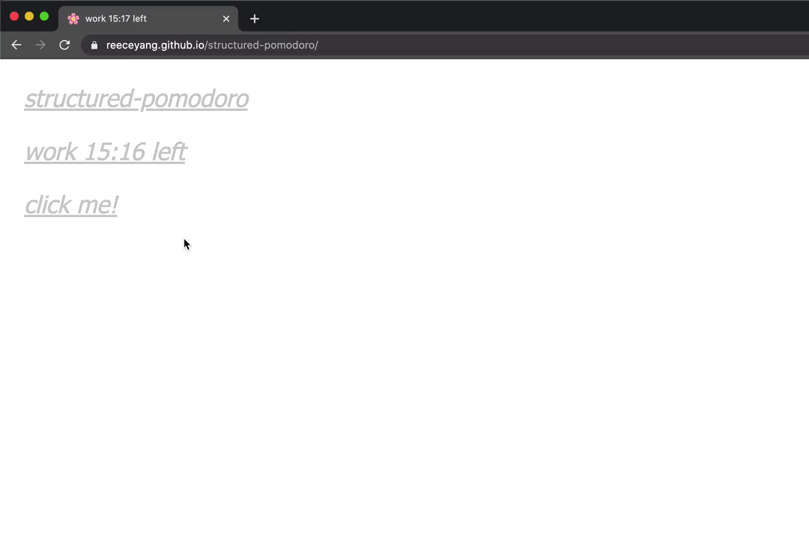

# structured-pomodoro

A super minimal pomodoro timer for your browser tab bar. Based on point 5 from [here](https://guzey.com/productivity/).

The timer automatically follows this schedule:
- work for 25 minutes from :05 to :30
- take a 5 minute break from :30 to :35
- work for 25 minutes from :35 to :00
- take a 5 minute break from :00 to :05
